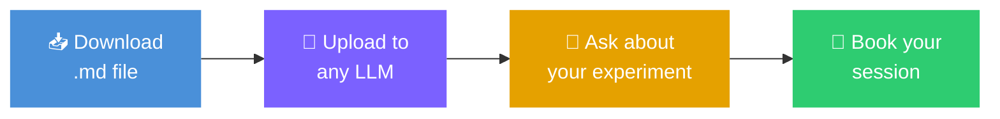

<p align="center">
  <strong>🔬 Intelligent-Microscopy</strong><br>
  <em>LLM-assisted experiment planning for advanced bioimaging and tissue imaging</em>
</p>

<p align="center">
  <a href="#quick-start">Quick Start</a> •
  <a href="#systems">Systems</a> •
  <a href="#what-can-the-llm-help-with">Capabilities</a> •
  <a href="#try-it-now">Try It Now</a> •
  <a href="#tips-for-getting-useful-answers">Tips</a> •
  <a href="#methodology">Methodology</a>
</p>

<p align="center">
  
  
  
  
</p>

---

Every microscope session starts with the same questions: *Which objective? Which laser lines? Will this even work on this system?*

**Intelligent-Microscopy** gives you structured reference files that describe the complete hardware configuration of advanced imaging systems — every objective, laser, detector, filter and acquisition module. Upload a file to any LLM and get answers grounded in the actual hardware before you sit down at the microscope.

> [!NOTE]
> This is a planning tool, not a replacement for hands-on training or facility staff. It helps you arrive at your session better prepared.

---

## Quick Start



**1.** Pick a microscope below and download its `.md` reference file

**2.** Upload it to [Claude](https://claude.ai), [ChatGPT](https://chat.openai.com), [Gemini](https://gemini.google.com) or any other LLM

**3.** Ask your question — the LLM will cross-check your plan against the real hardware

> [!TIP]
> Upload **all** the reference files at once and ask *"Which system is best for my experiment?"* — the LLM will compare across microscopes and recommend one.

---

## Systems

Reference files are organised by vendor:

```
Intelligent-Microscopy/
├── Leica/
│   ├── HCF2.md — STELLARIS 8 (confocal)
│   └── HCF3.md — STELLARIS 8 Tau-STED FALCON (FLIM / STED nanoscopy)
├── Nikon/
│   └── HCF4.md — AX R MP NSPARC (confocal / multiphoton)
└── Zeiss/
    └── HSR1.md — Lattice SIM 5 (super-resolution SIM)
```

| System | Vendor | Modalities | File |
|--------|--------|-----------|------|
| **HCF2** — STELLARIS 8 | Leica | Confocal, spectral detection | [✅ Download](Leica/HCF2.md) |
| **HCF3** — STELLARIS 8 Tau-STED FALCON | Leica | Confocal, STED super-resolution, FLIM | [✅ Download](Leica/HCF3.md) |
| **HCF4** — AX R MP NSPARC | Nikon | Confocal, resonant, multiphoton, FLIM, FRET, SHG, ISM super-resolution | [✅ Download](Nikon/HCF4.md) |
| **HSR1** — Lattice SIM 5 | Zeiss | Lattice SIM, SIM Apotome, widefield | 🔜 Coming soon |

---

## Living Documents

These reference files are **not static spec sheets**. Every file carries a version timestamp (date and time) and is updated continuously to reflect:

- 🧑‍🔬 **Real-world experience** — lessons from student training sessions, facility projects and day-to-day use shape what goes into the files: common mistakes, non-obvious settings, practical tips that don't appear in any manual
- 🔬 **Instrument behaviour** — hardware changes, filter swaps, new objectives, firmware updates and observed instrument quirks are recorded as they happen
- 🤖 **LLM model development** — as language models evolve, we revise file structure, terminology and level of detail to get the most reliable reasoning from current-generation models

> [!IMPORTANT]
> Always download the latest version before starting a new project. Check the version timestamp at the top of each file — if your copy is more than a few weeks old, it may not reflect the current state of the instrument.

---

## What can the LLM help with?

### 🟢 Before your session
> Design the experiment before you book
- Check feasibility on a particular microscope
- Choose objectives, laser lines and detection paths for your fluorophores
- Estimate acquisition time for tiling, Z-stacks and time-lapse
- Design automated acquisition workflows
- Compare two microscopes for your application

### 🟡 During your session
> Quick answers while you're at the microscope
- Troubleshoot dim or noisy images
- Look up filter specs, detector ranges or laser lines
- Identify unexpected signals — autofluorescence? bleed-through?

### 🔵 After your session
> Process, document and publish
- Plan an analysis pipeline for your data
- Draft a methods section describing your acquisition
- Calculate scale bars from acquisition metadata
- Prepare figures for publication

---

## Try It Now

> [!TIP]
> Examples below use **HCF4** (Nikon AX R MP NSPARC) to show the depth of questions possible. The same style of question works for any system — just upload the relevant `.md` file.

### 🟢 Everyday confocal and widefield — MSc / new users

<details>
<summary><strong>"I need to image my fixed tissue section — where do I start?"</strong></summary>

```
I have a 10 µm cryosection of mouse lung on a glass slide, stained with
DAPI and Alexa Fluor 488 phalloidin. I just want a nice overview image
of the whole section. What laser lines, filters, and objectives should I use?
```

> The LLM will identify the 405 nm and 488 nm lines from the laser unit, recommend the descanned detector with appropriate spectral windows, and suggest the 10× or 20× air objective for an overview. It will also explain that you can tile the section using the motorised stage.

</details>

<details>
<summary><strong>"How do I tile a large tissue area?"</strong></summary>

```
My tissue section is about 8 mm × 5 mm. I want to acquire it at 20× with
a Z-stack of 10 slices at 1 µm spacing, then stitch it into a single image.
How long will this take?
```

> The LLM will estimate the number of tiles based on the 20× field of view, factor in overlap for stitching, multiply by the Z-stack, and give a rough acquisition time for galvano vs resonant scanning.

</details>

<details>
<summary><strong>"Which objective do I pick for my coverslip?"</strong></summary>

```
I have cells on a #1.5 coverslip in a 24-well plate. Do I use the 60× oil
or the 40× water immersion for fixed cells stained with three colours?
```

> The LLM will compare the two objectives by NA, working distance, and resolution, and explain which suits fixed cells on a standard coverslip.

</details>

<details>
<summary><strong>"Can I see my three labels without bleed-through?"</strong></summary>

```
My cells are stained with DAPI, Alexa Fluor 568, and Alexa Fluor 647.
Will the channels bleed into each other on the confocal?
```

> The LLM will map each dye to a laser line, suggest sequential vs simultaneous acquisition, and recommend spectral windows that separate the three emission peaks.

</details>

<details>
<summary><strong>"How thick should my Z-steps be?"</strong></summary>

```
I want a confocal Z-stack of GFP-expressing cells at 60× oil for a 3D
reconstruction. What Z-step size should I use?
```

> The LLM will calculate the Nyquist sampling interval based on objective NA, emission wavelength, and pinhole setting.

</details>

<details>
<summary><strong>"How do I set up DIC?"</strong></summary>

```
I need to check cell morphology using DIC before fluorescence. Which DIC
components are on HCF4 and which do I use for each objective?
```

> The LLM will list the installed DIC sliders for each magnification and explain the required polariser and analyser combination.

</details>

<details>
<summary><strong>"I want to image live cells — what do I need to turn on?"</strong></summary>

```
I want a 4-hour time-lapse of GFP-expressing HeLa cells. What keeps them
alive on the microscope and how do I stop focus from drifting?
```

> The LLM will recommend the cage incubator, Perfect Focus System, and if relevant the water immersion dispenser, and suggest the resonant scanner for reduced phototoxicity.

</details>

### 🟡 Standard confocal and multiphoton — MSc / PhD

<details>
<summary><strong>"Can I do this four-colour protocol?"</strong></summary>

```
I want to image DAPI, AF488, AF568, and AF647 in cleared mouse brain at
25× silicone immersion, Z-stack through 500 µm. Can HCF4 do this?
```

> The LLM will check laser lines, confirm the silicone objective is installed, verify four-channel separation on the descanned detector, and estimate acquisition time.

</details>

<details>
<summary><strong>"Is my tiling plan realistic for my booking?"</strong></summary>

```
I want a 6 × 6 tiled Z-stack (30 slices, 2 µm spacing) of mouse kidney
at 20×, two channels, galvano 1024 × 1024. How long and is there a
faster way?
```

> The LLM will estimate total time and suggest whether resonant scanning or lower resolution would be acceptable.

</details>

<details>
<summary><strong>"Help me plan a multipoint time-lapse"</strong></summary>

```
I have a 6-well plate, 5 positions per well, every 30 minutes for
12 hours, Z-stack of 5 slices, GFP only. Can I fit this into each
interval? What JOBS setup do I need?
```

> The LLM will calculate whether 30 positions fit within the 30-minute window, recommend resonant scanning for speed, and outline a JOBS workflow.

</details>

### 🔴 Advanced FLIM and multiphoton — PhD / Postdoc

<details>
<summary><strong>"Can I do two-photon FLIM of metabolic cofactors?"</strong></summary>

```
I want two-photon FLIM of NAD(P)H (750 nm excitation, 450/70 emission)
and FAD (890 nm, 550/88 emission) in live cells. Can HCF4 do this?
```

> The LLM will verify the laser tuning range covers both wavelengths, confirm both NDD filter cubes are installed, and check PicoQuant FLIM detector availability.

</details>

<details>
<summary><strong>"Which detector path for FRET-FLIM?"</strong></summary>

```
I'm using mTurquoise2 (donor) and mVenus (acceptor). NDD or descanned
for the cleanest donor lifetime?
```

> The LLM will compare NDD collection efficiency against descanned spectral flexibility and recommend the best path for your fluorophore pair.

</details>

<details>
<summary><strong>"Is my FLIM acquisition plan optimal?"</strong></summary>

```
512 × 512, 8 µs pixel dwell, 60 frame accumulation, 4 × 4 tile,
10 % overlap, every 15 minutes for 6 hours. Does this make sense?
```

> The LLM will estimate total frame time, flag scanner compatibility with FLIM, check PFS viability over 6 hours, and suggest JOBS automation.

</details>

<details>
<summary><strong>"Help me build a FLIM screening workflow"</strong></summary>

```
Screen a 96-well plate for metabolic FLIM signatures: autofocus each well,
single-plane two-photon FLIM at 750 nm, review lifetime maps afterwards.
What JOBS nodes?
```

> The LLM will outline the full JOBS Editor workflow from well-plate definition through to JOBS Viewer review.

</details>

<details>
<summary><strong>"Confocal FLIM vs two-photon FLIM?"</strong></summary>

```
For GFP lifetime in thick tissue — confocal at 488 nm with pinhole,
or two-photon at 920 nm with NDD? Pros and cons on HCF4?
```

> The LLM will compare depth penetration, scattering, photobleaching, detector sensitivity, and laser power at each wavelength.

</details>

<details>
<summary><strong>"Can I do SHG alongside FLIM?"</strong></summary>

```
I want collagen SHG simultaneously with NAD(P)H FLIM in a skin biopsy
at 750 nm excitation. Which detector picks up the SHG?
```

> The LLM will identify the SHG signal at 375 nm, check whether the diascopic detector can collect it, and confirm the NDD handles the NAD(P)H channel.

</details>

---

## Tips for Getting Useful Answers

| Tip | Why it helps |
|-----|-------------|
| **Don't be afraid to ask basic questions** | *"What does the pinhole do?"* — the LLM will explain using the actual hardware, not a generic textbook answer |
| **Be specific about your sample** | *"Live primary mouse macrophages on a 35 mm glass-bottom dish, labelled with mClover3"* lets the LLM reason about coverslip compatibility, immersion medium and objectives. For fixed tissue, mention section thickness, mounting medium and coverslip type |
| **State your time constraints** | *"I have a 2-hour booking slot"* helps the LLM estimate whether a large tiling job will finish in time |
| **Mention your analysis plan** | Planning colocalisation? The LLM will stress sequential acquisition and Nyquist sampling. Phasor FLIM? It may suggest fewer photons are acceptable |
| **Tell it what you have already tried** | *"My image is dim and noisy at 40×"* gives the LLM something concrete to troubleshoot |
| **Iterate** | Start with a rough plan, ask the LLM to critique it, then refine |

---

## Quick-Start Checklist

Before your LLM conversation, gather the following and paste it into your prompt alongside the `.md` reference file:

- [ ] **Fluorophore(s)** — names, excitation / emission maxima
- [ ] **Sample type** — cells, tissue section, organoids, whole mount; fixed or live
- [ ] **Sample thickness** — monolayer, cryosection thickness, cleared tissue depth
- [ ] **Substrate** — glass-bottom dish, chamber slide, well plate, standard slide; coverslip #1, #1.5, or none
- [ ] **Mounting medium** (fixed) or **culture medium** (live)
- [ ] **What you want to produce** — overview image, 3D reconstruction, colocalisation map, lifetime map, tiled section
- [ ] **Spatial resolution needed** — whole-section overview, cellular detail, subcellular structures
- [ ] **Time resolution needed** — single snapshot, Z-stack, time-lapse interval and total duration
- [ ] **Constraints** — booking length, laser safety training status, sample viability

---

## Methodology

This project follows four principles for building instrument reference files that LLMs can reliably reason over:

| Principle | Rule |
|-----------|------|
| **Precision over assumption** | Specifications are never inferred. If verified data is unavailable, the field is left blank. |
| **Source priority** | The equipment quotation reflecting the installed configuration takes precedence over manufacturer websites. |
| **Completeness over token economy** | Reference files are as comprehensive as possible. Context-window cost is negligible compared to failed experiments and wasted samples. |
| **Explicit limitations** | Every file flags what the system *cannot* do — critical for correct LLM reasoning across instruments. |

---

## Limitations

> [!CAUTION]
> Responses may contain errors, omit important constraints or suggest inappropriate settings. Always verify recommendations against the original documentation and discuss with facility staff when in doubt.

- The LLM **cannot control any microscope** or acquire images
- It does **not know the live state** of the hardware (mounted objectives, incubator status, laser warm-up)
- It **cannot replace training** — especially for laser safety, alignment and system-specific procedures
- It does **not have access** to your sample's actual brightness or labelling efficiency
- **Quantitative analysis** (lifetime fitting, cell counting, deconvolution) requires dedicated software — the LLM can help you choose settings but not run the analysis
- For anything the LLM cannot resolve, **contact FILM staff** or book an Image Analysis Support session

---

## Collaboration

This is a methodological and research project exploring how LLMs can serve as advisory tools in advanced imaging environments.

We are particularly interested in collaboration with **Nikon** on extending LLM-assisted workflows for the AX R MP NSPARC platform and related systems.

We welcome contributions from:
- 🏛️ **Microscopy facilities** — adapt these reference files for your own instruments
- 🔧 **Instrument manufacturers** — improve accuracy and coverage
- 🧪 **Researchers** — share use cases, report errors, suggest improvements

To contribute, please [open an issue](../../issues) or get in touch.

---

## Acknowledgements

Developed at the **Facility for Imaging by Light Microscopy (FILM)**, Imperial College London.

---

## Licence

This work is licensed under [Creative Commons Attribution 4.0 International (CC BY 4.0)](https://creativecommons.org/licenses/by/4.0/).

You are free to share and adapt this material for any purpose, including commercial use, provided you give appropriate credit.

---

<sub>All outputs are advisory only. Experimental decisions remain the responsibility of trained facility staff and researchers. Pricing, personal identifiers and contact information have been removed from all reference material.</sub>
